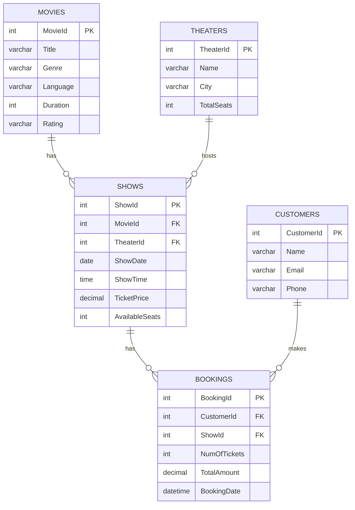

# Entity Relationship Diagram

This diagram shows how the tables in the Movie Ticket Booking System relate
to each other. It renders automatically on GitHub since GitHub supports
Mermaid diagrams in markdown files.

## Relationship Summary

- One **Movie** can have many **Shows** (different theaters/times)
- One **Theater** can host many **Shows**
- One **Show** can have many **Bookings**
- One **Customer** can make many **Bookings**
